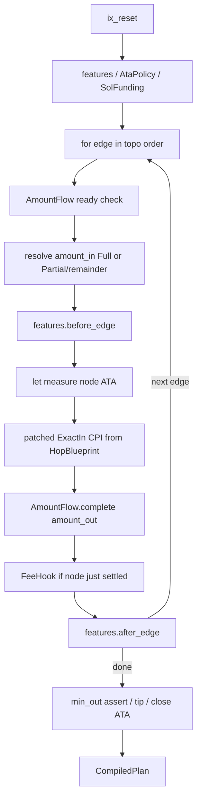

English | [中文](./design.zh-CN.md)

# ifx-orchestrator: framework-first ExactIn execution layer

## Positioning

This repo is not a pathfinder and not an on-chain router. It reimplements what aggregator / router **programs** usually do on-chain, using **ifx primitives off-chain**: given a topologically ordered set of edges (hops) plus account context, compile an executable ifx plan / transaction.

Versus Jupiter’s on-chain router: equally **batteries-included** (fluent `orchestrator.Builder`), but **venues / features / lifecycle policies are pluggable** — customization does not require forking a rigid path.

**Language: Go first** (dominant backend stack; aligns with `ifx/go-sdk` and existing `ifx-launchpad-orchestrator`). Rust / TS mirrors later.

Reference sources:
- **Exact** (abandoned program): graph execution + policy enums → **absorb ideas, do not port the on-chain program**
- **Go launchpad-orchestrator**: multi-leg ifx planning / sponsor / bridge → **behavior and snippet reference**, not a wholesale fork into a general framework
- **ifx-raydium-ext / pumpfun-ext**: venue ix / offset material → thin Go adapters in Phase 1

Exact’s one-line legacy: **“A route is a DAG with splits; a DEX is just a patchable instruction template on an edge.”**

## What to take from Exact / what to leave

### Absorb (priority order)

1. **DAG nodes + edges + `SplitBps` + `ExecutionContext` graph engine**
   - Node = mint / ATA endpoint; edge = ExactIn venue call + `from/to` + split bps
   - Client guarantees topological order; the engine only checks “all in-edges ready,” and the last partial edge takes the remainder (avoids dust from bps rounding)
   - Off-chain: `AmountFlow` (adapted from `ExecutionContext`) drives let/patch amount resolution; MVP linear paths are a DAG special case

2. **`CustomInstruction { data_template, amount_in_offset, amount_out_offset }`**
   - Lifted to `HopBlueprint` + `PatchSite`; **extension axis is Custom/Venue, not a BuiltIn enum**
   - Exact patched on-chain then `invoke`; this repo uses ifx `let` + `raw_cpi_patch`

3. **`TokenAccountLifecycleStrategy` → `AtaPolicy`**
   - `UseOnly | UseAndClose | CreateAndCloseCreated | CreateAndCloseAll | CreateOnly`
   - Route-level Feature / policy — not inside venues

4. **`PdaLamportsBudget` → `RentPeakEstimate` (first-class, not only a sponsor helper)**
   - Simulate ATA create/close over the graph: **peak_reserve / total_spent / total_returned / net**
   - End-state net may be ≈0 (`CreateAndClose*`), while the **peak mid-tx** can still exceed the user’s SOL
   - Consumed by two Features: `FlashRent` (temporary peak borrow) and `GasSponsored` (third-party front)

5. **`FlashRent` (pluggable backend; default Jupiter Flash Fill)** — see “Rent peak × Flash” below
   - Feature only owns the sandwich: `before_route` borrow → mid ATA/swap → `after_route` repay
   - **Default backend = Jupiter Flash Fill** (`JUPLdTqUdKztWJ1isGMV92W2QvmEmzs9WTJjhZe4QdJ`, deployed on mainnet)
   - **Must support custom** borrow / repay instruction pairs (own program, sponsor front + ifx assert, etc.)

6. **`SolInputStrategy` + `unwrap_output_sol` → `SolFundingPolicy` + post-hooks**
   - Wrap/unwrap are pre/post hop hooks, not DEX details

7. **`fee_node_index` semantics → `FeeHook`**
   - “After a node’s in-edges settle, before its first out-edge, charge platform fee once” → middle step / Feature on the graph

8. **`GasPaymentStrategy` → `SponsorRepayMode`**
   - InterceptWsol / TokenTransfer / (later) SwapToSol; prefer Intercept first, aligned with launchpad repay
   - Orthogonal to `FlashRent`: flash covers **peak liquidity**; sponsor covers **fees / sponsorship + repay from trade proceeds**

## Rent peak × Flash: recommended composition

Problem (Exact named it; Jupiter flash-fill productized it):

| Quantity | Meaning |
|----|------|
| `peak_reserve` | Peak ATA rent simultaneously live mid-tx — what the wallet must cover **right now** |
| `net_change` | Net spend after the tx; often ≈0 under CreateAndClose strategies |
| Gap | `user_lamports < peak_reserve` but `net≈0` → not “can’t pay rent,” but “can’t clear the peak” |

Jupiter Flash Fill: same tx `borrow` → setup/swap/close → `repay`; program scans the Instructions sysvar for a matching repay. Exact’s peak is more general (multiple intermediate mints created at once) — `RentPeakEstimate` computes the general peak; the default Jupiter backend only lends **one TokenAccount rent**, so larger peaks need a custom backend.

**This repo: Feature owns the sandwich; lender backend is pluggable; default is Jupiter.**

```text
AtaPolicy(CreateAndClose*) ──► RentPeakEstimate
                                      │
            ┌─────────────────────────┼─────────────────────────┐
            ▼                         ▼                         ▼
      user covers peak     FlashRent + RentBackend      GasSponsored
      (no flash)           default JupiterFlashFill     front → repay from proceeds
                           or Custom { borrow, repay }
```

Backend contract:

```go
type RentLiquidityBackend interface {
    BorrowIx(cx *FlashRentCtx) (solana.Instruction, error)
    RepayIx(cx *FlashRentCtx) (solana.Instruction, error)
}

// Default: Jupiter Flash Fill (mainnet JUPLdTq…)
type JupiterFlashFill struct { /* Borrower, Authority PDA, … */ }

// Arbitrary custom borrow / repay
type CustomRentLiquidity struct {
    Borrow, Repay solana.Instruction
    // or BorrowFunc / RepayFunc
}

func Auto() Feature                    // default JupiterFlashFill; only when there is a gap
func AutoWith(b RentLiquidityBackend) Feature
```

Batteries-included:

```go
orchestrator.New(frame).
    AtaPolicy(ata.CreateAndCloseCreated).
    Feature(flashrent.Auto()). // ≡ Jupiter Flash Fill
    // Feature(flashrent.AutoWith(CustomRentLiquidity{Borrow: …, Repay: …})).
    Hop(...).
    Build()
```

Rules:

- Do not put flash inside venues; `auto` only when `need = peak - user_available > 0`
- Jupiter is the **default implementation**, not the only one; custom backends only need a borrow/repay pair
- Jupiter’s amount semantics are “one TokenAccount rent”; document swapping to `CustomRentLiquidity` / a backend that can lend `peak_reserve` for larger peaks

### Explicitly discard

- The on-chain Exact program / remaining-accounts slicing / on-chain balance-delta as sole truth
- Giant `ExactInBuildInInstruction` zoo and empty `todo!()` DEXes
- Empty ExactOut, fake SDKs, buggy on-chain details (comments disagreeing with code, etc.)
- Over-generic on-chain `SwapStep<A,M,T,S>` style → prefer concrete off-chain types

## Core model



- Edge 0 / source node: `amount_in` known
- Later edges: `AmountFlow` resolves `amount_in` → patch; output accumulates on the destination node
- Splits: multiple out-edges from one node use `SplitBps`; last edge takes remainder
- MVP: linear `.Hop()` sugar still builds an internal path DAG; name APIs in graph terms from day one to avoid a rewrite

## Naming

| Exact concept | Name here | Role |
|------|------|------|
| mint+ATA node | **`RouteNode`** | mint, user ATA, lifecycle intent |
| `SwapExactInStep` | **`RouteEdge`** | `from/to` + `SplitBps` + `ExactInHop` + optional `min_out` |
| `SplitBps` | **`SplitBps`** | `Full \| Partial(NonZeroU16)`, absorbed as-is |
| `ExecutionContext` | **`AmountFlow`** | readiness, split rounding, fee/repay hooks (pure off-chain sim) |
| `CustomInstruction` | **`HopBlueprint`** | template ix + amount_in/min_out `PatchSite` |
| `pool::Step` / BuiltIn | interface **`ExactInHop`** | blueprint only; **no** core DEX enum |
| `TokenAccountLifecycleStrategy` | **`AtaPolicy`** | Feature |
| `SolInputStrategy` | **`SolFundingPolicy`** | Feature / prelude |
| `PdaLamportsBudget` | **`RentPeakEstimate`** | peak/net math; feeds FlashRent / sponsor |
| — (Jupiter flash-fill) | **`FlashRent` + `RentLiquidityBackend`** | default `JupiterFlashFill`; swappable custom borrow/repay |
| `GasPayment*` | **`GasSponsored` + `SponsorRepayMode`** | Feature |
| `fee_node_index` | **`FeeHook`** | Feature |
| — | **`MevTip`** | Exact lacked this; new Feature here |
| Facade | **`orchestrator.Builder`** | fluent batteries-included API |

Sketch (Go):

```go
type SplitBps struct { /* Full | Partial(1..9999) */ }

type RouteNode struct {
    Mint         solana.PublicKey
    TokenAccount solana.PublicKey
}

type RouteEdge struct {
    From, To NodeID
    Split    SplitBps
    Hop      ExactInHop
    MinOut   *uint64
}

type ExactInHop interface {
    VenueID() string
    BuildBlueprint(cx *HopBuildCtx) (HopBlueprint, error)
}

type HopBlueprint struct {
    Template  solana.Instruction // amount placeholders 0
    AmountIn  PatchSite
    MinOut    *PatchSite
}

type PatchSite struct{ Offset uint16 } // u64 LE

type Feature interface {
    BeforeRoute(cx *CompileCtx) error
    BeforeEdge(cx *CompileCtx, i int) error
    AfterEdge(cx *CompileCtx, i int) error
    AfterRoute(cx *CompileCtx) error
    MapForwardAmount(cx *CompileCtx, amount scratch.Value) (scratch.Value, error) // default identity
}

type RentLiquidityBackend interface {
    BorrowIx(cx *FlashRentCtx) (solana.Instruction, error)
    RepayIx(cx *FlashRentCtx) (solana.Instruction, error)
}
```

Batteries-included API (linear sugar):

```go
plan, err := orchestrator.New(frame).
    AmountIn(1_000_000).
    MinAmountOut(900_000).
    AtaPolicy(ata.CreateAndCloseCreated).
    SolFunding(solfunding.PreferNativeSol).
    Hop(raydiumcpmm.NewExactIn(ctx1)).
    Hop(meteoradamm.NewExactIn(ctx2)).
    Hop(pumpfun.NewExactIn(ctx3)).
    Feature(flashrent.Auto()). // default JupiterFlashFill; or AutoWith(custom)
    Feature(gassponsored.InterceptWSOL(sponsor)).
    Feature(feehook.OnNode(1, bps, recipient)).
    Feature(mevtip.New(tipReceiver)).
    Build()
```

Advanced: `orchestrator.FromGraph(nodes, edges, features)` — splits without changing the framework.

## Repo layout (Go)

```text
ifx-orchestrator/
  go.mod                     # module github.com/ifx-run/ifx-orchestrator
  README.md
  orchestrator/             # Builder facade
  compile/                   # RouteCompiler + CompileCtx + AmountFlow
  hop/                       # ExactInHop, HopBlueprint, PatchSite, SplitBps, Node/Edge
  feature/                   # Feature interface + built-in stubs (Ata/FlashRent/…)
  venue/
    mock/
    raydiumcpmm/             # Phase 1
  examples/mock_two_hop/
  cmd/demo-simulate/         # Phase 1+
```

Dependencies: `github.com/ifx-run/ifx/go-sdk` (≥0.1.2), `github.com/gagliardetto/solana-go` (aligned with launchpad-orchestrator).

Portable from launchpad (not wholesale): `internal/ifx` multi-leg let/patch order, `bridge/offsets.go`, sponsor repay shape.

**Explicit non-goals (v1):** pathfinder, HTTP quoting service, fat UI, wholesale migration of old exts, ExactOut, new on-chain router, parallel Rust/TS.

## Phased delivery

### Phase 0 — Framework + mock (first cut)

1. `go mod` + core packages: `SplitBps`, `RouteNode`/`RouteEdge`, `AmountFlow`, `HopBlueprint`/`PatchSite`, `ExactInHop`, `Feature`, `compile`, `orchestrator`
2. Linear `.Hop()` sugar builds a path; `AmountFlow` unit tests cover Full path + **one split (two out-edges) amount resolution**
3. Feature stubs: `AtaPolicy` enum in place (impl may start as `UseOnly`); `GasSponsored` / `MevTip` / `FeeHook` / `FlashRent` interface stubs
4. `venue/mock` + tests asserting ix shape and patches; `examples/mock_two_hop`

Acceptance: adding a hop = implement `ExactInHop` + `.Hop(...)`; the Exact-style “Custom edge” extension point is obvious.

### Phase 1 — Real venues, minimal glue

1. `venue/raydiumcpmm`: Go template + offsets (+8 / +16; vs raydium-ext / launchpad bridge)
2. One more venue: Pump or Meteora DAMM (launchpad already has accounts/offsets)
3. `cmd/demo-simulate`: hard-coded multi-hop → simulate; self-check that glue stays near “blueprint only”

### Phase 2 — Exact policies + Flash rent for real

- Full `AtaPolicy` branches + **`RentPeakEstimate` (from Exact `PdaLamportsBudget`)**
- **`FlashRent`**: `RentLiquidityBackend` interface; **default `JupiterFlashFill`**; `CustomRentLiquidity` for arbitrary borrow/repay; `Auto` gating + AtaPolicy combo example
- `CUSTOMIZING.md` (incl. “how to swap Flash backend”)

### Phase 3 — Sponsor / tip / fee + Pump + simulate ✅

- `GasSponsored` (baseline → assert → patched repay; optional ATA rent); orthogonal to FlashRent
- `MevTip`, `FeeHook` (fixed + proceeds bps)
- `venue/pumpfun` native `BuyExactSolIn` / `SellExactIn`
- `examples/simulate_mainnet`: hard-coded hop → build → RPC simulate
- Remaining deferred: `SponsorRepayMode.SwapToSol`, richer SolFunding policies (e.g. wrap-from-sponsor)

### Phase 4 — SolFunding + mid-graph fee + repay modes ✅

- `solfunding`: wrap + unwrap modes (`UnwrapLamports` Partial/All preferred over Close)
- `feehook.AtNode` (Exact fee_node_index): Fixed and TokenBps are separate Features; registration order controls charge order
- `gassponsored`: `FromNative` (SOL/WSOL + protection bps) / `FromToken` (fixed amount)

## Design discipline

- Keep ifx thin; venues own accounts/ix; Features stay orthogonal
- **Extension axis = `ExactInHop` (Custom); no core BuiltIn DEX enum**
- Compiler does not pathfind; the graph is supplied (or path sugar generates it)
- Default tx packing v1; compile strategy pluggable
- Do not copy Exact’s on-chain bugs / empty shells
- **Go first**; Rust/TS SDK mirrors must not block MVP

## Compiler principles (zero-cost ifx)

Hard rules for when the builder may emit ifx. More items may be added. **Violations are bugs.**

1. **Emit ifx only when required.** The test is **runtime Frame bindings**, not hop count. With no chained Δ, Frame asserts, or patched CPI that reads a slot, the output **must contain no ifx instructions, including `IfxResetFrame`**. Bake compile-time `amount_in` / `min_out` / fixed wrap / fixed fees. A **single hop** still needs Reset + Let + patch when a Feature measures after the hop (bps fee, `HopConserve`, arbcheck, …); two hops need it to forward Δ. Do not `let` a constant just to patch it.
2. **Consecutive `IfxLet` must merge into one instruction.** Share one `LetBuilder` at construction via `feature.Ctx.Let()`; `Emit` of a non-let ix flushes. Two adjacent `Let`s that only bind two constants are forbidden.
3. **Public API stays small and hard to misuse.** Keep Builder / Feature / hop surfaces short; do not require a Frame for constant-only plans (`New(nil, user)` is valid). Demand scratch only when a runtime binding is needed, with an error that says why. Do not present “let a constant then patch” as the happy path.

## Graph / split / Feature order (current)

- **`Route.Validate()`** is the compile gate for topo, mint chaining, and split sums.
- **AmountFlow** is compile-time readiness + **source-node (0) Partial splits** (`MulBpsFloor`, overflow-safe). Hop outputs are stored in `nodeIn[to]` for later inbound edges; `Complete(amountOut)` is not on-chain output.
- **Supported**: linear Full; source fan-out + sink fan-in (diamond). **Not yet** (Validate rejects): mid-graph Partial fan-out, mid-graph fan-in with further outs.
- **Feature `Phase`**: Funding → Setup → Route → Settlement; `Before*` ascending, `AfterRoute` reversed. Registration order is stable within a phase — no silent “FlashRent before Ata” cross-phase rule.

## Risks and mitigations

- **Graph vs linear**: keep path API simple outside; write `AmountFlow` as a graph from day one
- **Measure accounts**: destination node ATA must support `spl_token_amount`; compile-time mint chaining checks
- **WSOL**: Phase 0 mock + SPL path; leave `SolFundingPolicy` interface, implement in Phase 2
- **Old exts**: extract templates/constants only — no UI / pool selection
