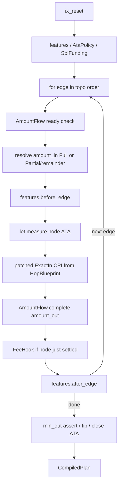

[English](./design.md) | 中文

# ifx-orchestrator：框架优先的 ExactIn 编排层

## 定位重申

本仓不是路径求解器，也不是链上 router。它把「聚合器 / router 合约」在链上做的事，用 **ifx 原语在后端**重做一遍：给定已排好序的边（hops）+ 账户上下文，编译成可执行的 ifx plan / tx。

对比 Jupiter 合约：**同样开箱即用**（fluent `orchestrator.Builder`），但 **venue / feature / 生命周期策略可插拔**，定制不必 fork 整条死板路径。

语言选定 **Go 先行**（后端使用最多；对齐 `ifx/go-sdk` 与已有 `ifx-launchpad-orchestrator`）。Rust / TS 镜像后置。

对照源：
- **Exact**（废弃合约）：图执行语义 + 策略枚举 → **吸收思路，不搬链上程序**
- **Go launchpad-orchestrator**：多腿 ifx 编排 / sponsor / bridge → **行为与片段对照**，不整仓 fork 成通用框架
- **ifx-raydium-ext / pumpfun-ext**：venue ix/offset 素材 → Phase 1 抽薄到 Go adapter

一句话遗产（Exact）：**「路由是带分流的 DAG；DEX 只是边上的可 patch 指令模板。」**

## 从 Exact 吸收什么 / 丢弃什么

### 吸收（按优先级）

1. **DAG 节点 + 边 + `SplitBps` + `ExecutionContext` 图执行机**
   - 节点 = mint/ATA 端点；边 = ExactIn venue 调用 + `from/to` + 分流 bps
   - 客户端保证拓扑序；执行机只校验「入边收齐再走」、最后一条 partial 边拿 remainder（避免 bps 取整漏粉）
   - off-chain 对应：`AmountFlow`（自 `ExecutionContext` 改编）驱动 let/patch 金额决议；MVP 线性 path 是 DAG 特例

2. **`CustomInstruction { data_template, amount_in_offset, amount_out_offset }`**
   - 直接升格为 `HopBlueprint` + `PatchSite`；**扩展主轴是 Custom/Venue，不是 BuiltIn enum**
   - Exact 在链上 patch+invoke；本仓用 ifx `let` + `raw_cpi_patch`

3. **`TokenAccountLifecycleStrategy` → `AtaPolicy`**
   - `UseOnly | UseAndClose | CreateAndCloseCreated | CreateAndCloseAll | CreateOnly`
   - 作为 Feature / 路由级策略，不进 venue

4. **`PdaLamportsBudget` → `RentPeakEstimate`（一等公民，不只是 sponsor 附属）**
   - 模拟图执行上 ATA create/close 的 **peak_reserve / total_spent / total_returned / net**
   - 用户最终可能 net≈0（CreateAndClose*），但 **峰值时刻**仍可能掏不出那么多 SOL
   - 输出供两类 Feature 消费：`FlashRent`（临时借 peak）与 `GasSponsored`（第三方垫付）

5. **`FlashRent`（可插后端；默认 Jupiter Flash Fill）** — 见下节「Rent peak × Flash」
   - Feature 只负责夹道：`before_route` borrow → 中间 ATA/swap → `after_route` repay
   - **默认后端 = Jupiter Flash Fill**（`JUPLdTqUdKztWJ1isGMV92W2QvmEmzs9WTJjhZe4QdJ`，主网已部署）
   - **必须支持自定义**：任意 `borrow` / `repay` 指令对（自建程序、sponsor 垫付+ifx assert 等）

6. **`SolInputStrategy` + `unwrap_output_sol` → `SolFundingPolicy` + PostHook**
   - wrap/unwrap 是 hop 前后钩，不是 DEX 细节

7. **`fee_node_index` 挂点语义 → `FeeHook`**
   - 「节点入边收齐后、首次出边前扣一次 platform fee」——映射为图上的中间步 / Feature

8. **`GasPaymentStrategy` → `SponsorRepayMode`**
   - InterceptWsol / TokenTransfer /（远期）SwapToSol；与 launchpad repay 对齐实现优先 Intercept
   - 与 `FlashRent` **正交可组合**：flash 解决「峰值流动性」；sponsor 解决「手续费/代付 + 从成交额扣还」

## Rent peak × Flash：推荐组合方式

问题本质（Exact 已说清，Jupiter flash-fill 已产品化）：

| 量 | 含义 |
|----|------|
| `peak_reserve` | 交易过程中同时存活的 ATA 租金峰值——用户钱包**当下**必须盖得住 |
| `net_change` | 结束后净支出；CreateAndClose 策略下常接近 0 |
| 缺口 | `user_lamports < peak_reserve` 但 `net≈0` → 不是「付不起租金」，是「过不了峰」 |

Jupiter Flash Fill：同笔 tx 内 `borrow` → setup/swap/close → `repay`；程序扫 Instructions sysvar 强制匹配 repay。Exact 的 peak 更一般（多中间 mint 同时 create）——`RentPeakEstimate` 算一般峰值；默认 Jupiter 后端若只借「一份 TokenAccount rent」，更大 peak 时换自定义后端。

**本仓做法：Feature 固定夹道，贷方后端可插；默认用 Jupiter。**

```text
AtaPolicy(CreateAndClose*) ──► RentPeakEstimate
                                      │
            ┌─────────────────────────┼─────────────────────────┐
            ▼                         ▼                         ▼
      user 够 peak         FlashRent + RentBackend      GasSponsored
      （不插 flash）       默认 JupiterFlashFill         垫付 → 从成交扣还
                           或 Custom { borrow, repay }
```

后端契约：

```go
type RentLiquidityBackend interface {
    BorrowIx(cx *FlashRentCtx) (solana.Instruction, error)
    RepayIx(cx *FlashRentCtx) (solana.Instruction, error)
}

// 默认：Jupiter Flash Fill（主网 JUPLdTq…）
type JupiterFlashFill struct { /* Borrower, Authority PDA, … */ }

// 任意自定义 borrow / repay
type CustomRentLiquidity struct {
    Borrow, Repay solana.Instruction
    // 或 BorrowFunc / RepayFunc
}

func Auto() Feature                    // 默认 JupiterFlashFill；仅缺口时启用
func AutoWith(b RentLiquidityBackend) Feature
```

开箱：

```go
orchestrator.New(frame).
    AtaPolicy(ata.CreateAndCloseCreated).
    Feature(flashrent.Auto()). // ≡ Jupiter Flash Fill
    // Feature(flashrent.AutoWith(CustomRentLiquidity{Borrow: …, Repay: …})).
    Hop(...).
    Build()
```

纪律：

- 不把 flash 写进 venue；`auto` 仅在 `need = peak - user_available > 0` 时启用
- Jupiter 是 **默认实现**，不是唯一实现；自定义只须提供 borrow/repay 指令对
- Jupiter 额度语义是「一份 TokenAccount rent」；更大 peak 时文档标明换 `CustomRentLiquidity` / 自建可借 `peak_reserve` 的后端

### 明确丢弃

- 链上 Exact program / remaining-accounts 分段 / 链上 balance-delta 作唯一真相
- 巨型 `ExactInBuildInInstruction` 动物园与空 `todo!()` DEX
- 空 ExactOut、假 SDK、有 bug 的链上细节（注释与代码不一致等）
- 过度泛型 `SwapStep<A,M,T,S>` 上链风格 → off-chain 用具体类型

## 核心模型



- 边0 / 源节点：`amount_in` 已知
- 后续边：源节点 `AmountFlow` 决议出 `amount_in` → patch；产出累加到目标节点
- 分流：同一节点多条出边用 `SplitBps`；最后一条拿 remainder
- MVP：线性 `hops` API 糖 → 内部仍建成 path DAG（2 节点/边…），接口从第一天按图语义命名，避免日后推倒

## 抽象命名

| Exact 概念 | 本仓名称 | 职责 |
|------|------|------|
| mint+ATA 节点 | **`RouteNode`** | mint、user ATA、生命周期意图 |
| `SwapExactInStep` | **`RouteEdge`** | `from/to` + `SplitBps` + `ExactInHop` + 可选 `min_out` |
| `SplitBps` | **`SplitBps`** | `Full \| Partial(NonZeroU16)`，原样吸收 |
| `ExecutionContext` | **`AmountFlow`** | 就绪校验、分流取整、fee/repay 挂点（纯 off-chain 模拟） |
| `CustomInstruction` | **`HopBlueprint`** | template ix + amount_in/min_out `PatchSite` |
| `pool::Step` / BuiltIn | interface **`ExactInHop`** | 只产出 blueprint；**无**核心内 DEX enum |
| `TokenAccountLifecycleStrategy` | **`AtaPolicy`** | Feature |
| `SolInputStrategy` | **`SolFundingPolicy`** | Feature / 前置 |
| `PdaLamportsBudget` | **`RentPeakEstimate`** | peak/net 计算；供 FlashRent / sponsor |
| — (Jupiter flash-fill) | **`FlashRent` + `RentLiquidityBackend`** | 默认 `JupiterFlashFill`；可换自定义 borrow/repay |
| `GasPayment*` | **`GasSponsored` + `SponsorRepayMode`** | Feature |
| `fee_node_index` | **`FeeHook`** | Feature |
| — | **`MevTip`** | Exact 没有；本仓新增 Feature |
| 门面 | **`orchestrator.Builder`** | fluent 开箱 API |

草图（Go）：

```go
type SplitBps struct { /* Full | Partial(1..9999) */ }

type RouteNode struct {
    Mint         solana.PublicKey
    TokenAccount solana.PublicKey
}

type RouteEdge struct {
    From, To NodeID
    Split    SplitBps
    Hop      ExactInHop
    MinOut   *uint64
}

type ExactInHop interface {
    VenueID() string
    BuildBlueprint(cx *HopBuildCtx) (HopBlueprint, error)
}

type HopBlueprint struct {
    Template  solana.Instruction // amount 占位 0
    AmountIn  PatchSite
    MinOut    *PatchSite
}

type PatchSite struct{ Offset uint16 } // u64 LE

type Feature interface {
    BeforeRoute(cx *CompileCtx) error
    BeforeEdge(cx *CompileCtx, i int) error
    AfterEdge(cx *CompileCtx, i int) error
    AfterRoute(cx *CompileCtx) error
    MapForwardAmount(cx *CompileCtx, amount scratch.Value) (scratch.Value, error) // 默认恒等
}

type RentLiquidityBackend interface {
    BorrowIx(cx *FlashRentCtx) (solana.Instruction, error)
    RepayIx(cx *FlashRentCtx) (solana.Instruction, error)
}
```

开箱 API（线性糖；贴近你拍的 Builder 幻想）：

```go
plan, err := orchestrator.New(frame).
    AmountIn(1_000_000).
    MinAmountOut(900_000).
    AtaPolicy(ata.CreateAndCloseCreated).
    SolFunding(solfunding.PreferNativeSol).
    Hop(raydiumcpmm.NewExactIn(ctx1)).
    Hop(meteoradamm.NewExactIn(ctx2)).
    Hop(pumpfun.NewExactIn(ctx3)).
    Feature(flashrent.Auto()). // 默认 JupiterFlashFill；可 AutoWith(custom)
    Feature(gassponsored.InterceptWSOL(sponsor)).
    Feature(feehook.OnNode(1, bps, recipient)).
    Feature(mevtip.New(tipReceiver)).
    Build()
```

进阶：`orchestrator.FromGraph(nodes, edges, features)` —— 支持 split，无需换框架。

## 仓库骨架（Go）

```text
ifx-orchestrator/
  go.mod                     # module github.com/ifx-run/ifx-orchestrator
  README.md
  orchestrator/             # Builder 门面
  compile/                   # RouteCompiler + CompileCtx + AmountFlow
  hop/                       # ExactInHop, HopBlueprint, PatchSite, SplitBps, Node/Edge
  feature/                   # Feature 接口 + 内置桩（Ata/FlashRent/…）
  venue/
    mock/
    raydiumcpmm/             # Phase 1
  examples/mock_two_hop/
  cmd/demo-simulate/         # Phase 1+
```

依赖：`github.com/ifx-run/ifx/go-sdk`（≥0.1.2）、`github.com/gagliardetto/solana-go`（对齐 launchpad-orchestrator）。

可从 launchpad 对照搬迁（非整仓）：`internal/ifx` 多腿 let/patch 顺序、`bridge/offsets.go`、sponsor repay 形状。

**刻意不做（首期）：** pathfinder、HTTP 报价服务、胖 UI、整仓迁旧 ext、实现 ExactOut、上新链上 router、同步写 Rust/TS。

## 分阶段交付

### Phase 0 — 框架 + mock（第一刀）

1. `go mod` + 核心包：`SplitBps`、`RouteNode`/`RouteEdge`、`AmountFlow`、`HopBlueprint`/`PatchSite`、`ExactInHop`、`Feature`、`compile`、`orchestrator`
2. 线性 `.Hop()` 糖内部建 path；`AmountFlow` 单测覆盖 Full path + **一次 split（两出边）金额决议**
3. Feature 桩：`AtaPolicy` 枚举就位（实现可先 `UseOnly`）；`GasSponsored`/`MevTip`/`FeeHook`/`FlashRent` 接口占位
4. `venue/mock` + 测试断言 ix 形状与 patch；`examples/mock_two_hop`

验收：加一跳 = 实现 `ExactInHop` + `.Hop(...)`；看得到与 Exact「Custom 边」同构的扩展点。

### Phase 1 — 真实 venue 验最小胶水

1. `venue/raydiumcpmm`：Go 侧 template + offsets（+8 / +16；对照 raydium-ext / launchpad bridge）
2. 再接 Pump 或 Meteora DAMM（launchpad 已有账户/offset 可对照）
3. `cmd/demo-simulate`：写死多跳 → simulate；自评接入 diff 是否接近「只有 blueprint」

### Phase 2 — Exact 策略 + Flash rent 做实

- `AtaPolicy` 全分支 + **`RentPeakEstimate`（自 Exact `PdaLamportsBudget`）**
- **`FlashRent`**：`RentLiquidityBackend` interface；**默认 `JupiterFlashFill`**；`CustomRentLiquidity` 接受任意 borrow/repay；`Auto` 门槛 + 与 AtaPolicy 组合 example
- `CUSTOMIZING.md`（含「如何换 Flash 后端」）

### Phase 3 — Sponsor / tip / fee + Pump + simulate ✅

- `GasSponsored`（baseline → assert → patched repay；可选 ATA rent）；与 FlashRent 正交
- `MevTip`、`FeeHook`（固定 + proceeds bps）
- `venue/pumpfun` 原生 `BuyExactSolIn` / `SellExactIn`
- `examples/simulate_mainnet`：写死 hop → build → RPC simulate
- 仍后置：`SolFundingPolicy` / unwrap、图中 `fee_node_index`、Intercept 以外的 `SponsorRepayMode`

## 设计纪律

- ifx 保持瘦；venue 胖在账户/ix；Feature 正交
- **扩展主轴 = `ExactInHop`（Custom），禁止核心 BuiltIn DEX enum**
- Compiler 不选路；图由调用方提供（或 path 糖生成）
- 默认 tx v1；编译策略可插
- 不把 Exact 的链上 bug / 空壳实现抄进来
- **Go 先行**；Rust/TS SDK 镜像不挡 MVP

## 风险与缓解

- **图 vs 线性**：对外 path API 简单；内部 `AmountFlow` 从第一天按图写，避免二次重构
- **计量账户**：边的 `to` 节点 ATA 可 `spl_token_amount`；compile-time 校验 mint 衔接
- **WSOL**：首期 mock + SPL path；`SolFundingPolicy` 接口先留，实现 Phase 2
- **旧 ext**：只抽 template/constants，不拖 UI/选池
